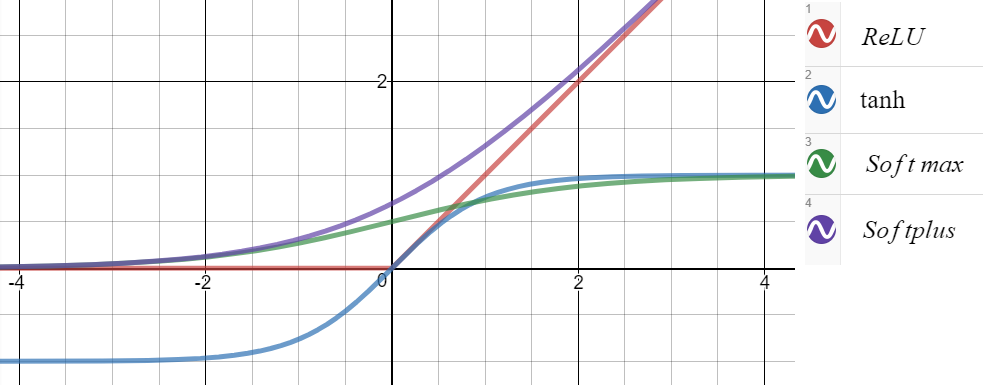

ImageNet為大型圖片資料集，約1500萬張已標記影像，類別約22,000種。ImageNet Large Scale Visual Recognition Challenge (ILSVRC)是Stanford教授李飛飛所領導[Vision Lab](http://vision.stanford.edu/people.html){:target="_blank"}在2010年開始舉辦、基於ImageNet的圖片辨識技術競賽([2017 workshop](https://www.youtube.com/watch?v=jYvBmJo7qjc){:target="_blank"}上宣布為最後一屆，之後會調整dataset內容並與Kaggle合辦)。

本文介紹的AlexNet是[ILSVRC-2012](http://www.image-net.org/challenges/LSVRC/2012/results.html){:target="_blank"}的冠軍，作者為多倫多大學知名教授[Geoffrey Hinton](http://www.cs.toronto.edu/~hinton/){:target="_blank"}(backprop主要貢獻者)和他當時的兩位博士生[Alex Krizhevsky](https://www.cs.toronto.edu/~kriz/){:target="_blank"}和[Ilya Sutskever](http://www.cs.toronto.edu/~ilya/){:target="_yblank"}，不僅在比賽中大勝其他對手，表現上也超越當時技術。此後ILSVRC的冠軍皆由CNN相關演算法奪得，後來的ZFnet, SPPnet, VGG等技術都是在其基礎之上做修正，似乎也是從那時候開始DL相關技術越來越被各界所重視。

這周介紹的[論文][1]{:target="_yblank"}(Conference Paper)主要說明在過去CNN的基礎上，他們為AlexNet引入了哪些tricks及其幫助model降低了多少error rate。

AlexNet的重要貢獻有：

 * 證明CNN加深能使表現更好
 * 使用GPU平行運算
 * 引入Dropout、LRN、Overlapping Pooling (但後兩者已逐漸被其他表現更好的技巧取代)。

 
AlexNet架構:



## **1. ILSVRC-2012's Dataset & Preprocessing for AlexNet**

### 1.1 ILSVRC-2012's Dataset
訓練集只取ImageNet當中120萬張圖(約1000classes, 每個class約1000張)、validation set五萬張、testing set十五萬張。

### 1.2 Preprocessing
1. **裁切至256×256**: 每張圖rescaling至短邊為256pixels，再將長邊裁切出256pixels。 (之後會再裁出數張224×224的圖)
2. **使pixels平均值為0**: 訓練集每張圖都減去訓練集上所有RGB pixels值的平均值。

## **2. Architecture**
論文中的ch.3, 依照重要程度順序列出他認為這個架構能在比賽中勝出的關鍵。

### 2.1 ReLU
隱藏層的activation function為ReLU（Rectified Linear Unit），函式為$f(x)=\max(0,x)$，論文中說明他們實驗得到<a href="../../images/PyTorchTP/AlexNetReLU.png" target="blank">在一個四層NN當中使用ReLU的收斂速度比tanh快上四倍</a>。

ReLU, tanh, softmax, softplus比較圖:  

ReLU勝於sigmoid、tanh的原因有：

1. 無梯度消失問題: 使用sigmoid、tanh時，若$x$非常大或非常小則梯度會趨近於零，造成學習效率降低，為梯度消失問題，而ReLU沒有這個缺點。

較於exponential計算更加快速

AlexNetReLU.png

主要講述ReLU效果的兩篇論文: [[3]][3]、[[4]][4]

## 3.

### 3.1 使用ReLU
一階微分經過訓練之後趨近於0

Softplus為ReLU之可微分的改良版

使用ReLU，輸出層用Softmax

#### 3.2 using GPUs
兩張Nvidia GTX 580的平行計算

#### 3.3 Local Response Normalization (LRN)

#### 3.4 Overlapping Pooling
解決Max Pooling損失太多訊號的缺點，使用stride=1的Max Pooling

※但有研究顯示效果並沒有非常好

### 4. Avoid Overfitting

#### 4.1 Data Aug
1. 256x256隨機裁切224224
2. PCA

#### 4.2 Dropout

Q: Why using Softmax in the output layer?
A: It gives the final result as the Probability?

Q: ReLU?
A: It mimics the behaviour of (Biology) neuron. It gives positive output when input is larger than threshold.

Leaky ReLU

Q: When to using Dropout?
A: When you get a decent performance of input
In this paper, the dropout ratio is 0.5.

## Reference

1. [Alex Krizhevsky, Ilya Sutskever, and Geoffrey E. Hinton. 2012. ImageNet classification with deep convolutional neural networks. In Proceedings of the 25th International Conference on Neural Information Processing Systems - Volume 1 (NIPS'12), F. Pereira, C. J. C. Burges, L. Bottou, and K. Q. Weinberger (Eds.), Vol. 1. Curran Associates Inc., USA, 1097-1105.][1]{:target="_blank"}
2. [本周講者Young Hu部落格][2]{:target="_blank"}

[ReLU为什么比Sigmoid效果好][5]{:target="_blank"}

[1]: http://papers.nips.cc/paper/4824-imagenet-classification-with-deep-convolutional-neural-networks.pdf
[2]: https://medium.com/@WhoYoung99/alexnet-架構概述-988113c06b4b
[3]: http://yann.lecun.com/exdb/publis/pdf/jarrett-iccv-09.pdf
[4]: https://www.cs.toronto.edu/~hinton/absps/reluICML.pdf
[5]: https://blog.csdn.net/algorithm_image/article/details/78042429
