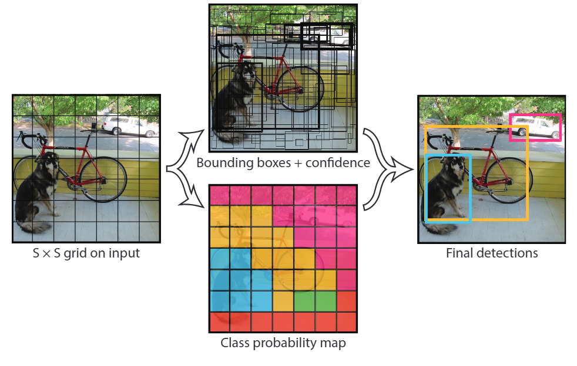
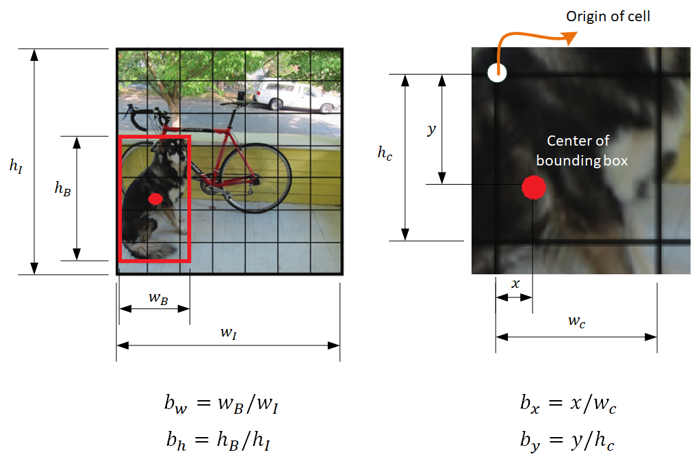
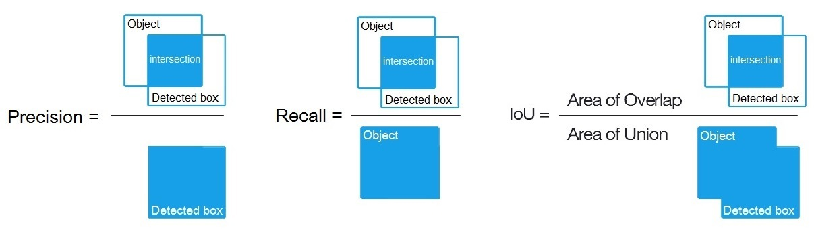
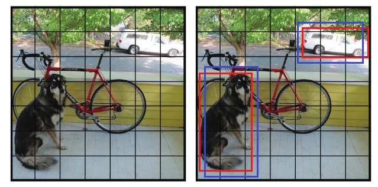
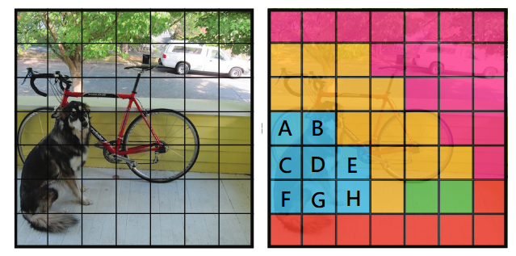
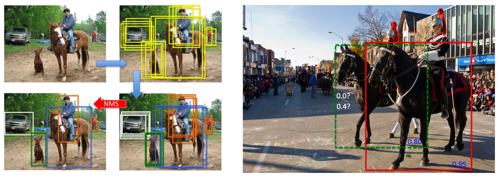
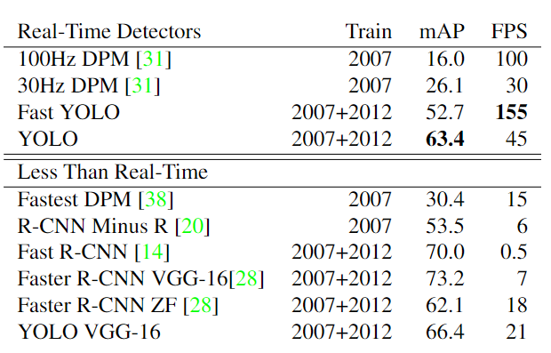
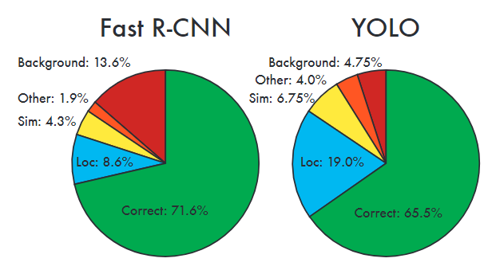

$$ \definecolor{lg}{RGB}{114,0,172} \definecolor{pi}{RGB}{18,110,213} \definecolor{og}{RGB}{217,86,16} \definecolor{f}{RGB}{45,177,93}$$



## **1. Intro**

[YOLO (You Only Look Once)][6]{:target="_blank"} 是[Joseph Redmon](https://pjreddie.com/){:target="_blank"}(他的[彩虹小馬CV](https://pjreddie.com/static/Redmon%20Resume.pdf){:target="_blank"})等人於2015年合著之real-time物件偵測(Object Detection)演算法，然而在2016和2018又再各推出了改良版YOLO(即[v2][5]{:target="_blank"}和[v3][4]{:target="_blank"})，可以說是目前該領域表現最佳之演算法。

本文為YOLO v1論文的閱讀筆記，架構以我自己認為比較好懂得順序重新編排(如果有人覺得還是很難懂可以底下留言跟我說XD)。論文其實閱讀上感覺並不困難，可能一天就能讀完，但不少實際運行方面的細節沒有寫出來，需要參考其他資料。(讀完論文到寫出這篇文章花了快一周...)

YOLO v1的創新之處在於跳脫過去DPM之sliding window技巧(一張圖需要多次輸入進CNN)和RCNN使用的region proposal + classify + refine組合技，整體來說將物件偵測看作是一個regression問題，每張圖只需輸入進CNN分類器一次(故運行速度大增)，輸出的tensor被訓練為圖上不同位置的物件特徵偵測結果，最後再以其存在機率判斷刪除多餘的偵測框線作為最後結果。

<i>Fig. 1. YOLO v1演算法示意圖。 </i> 

下面影片是YOLO運行結果，第一作者也曾經[在Ted上講解過YOLO](https://www.ted.com/talks/joseph_redmon_how_a_computer_learns_to_recognize_objects_instantly){:target="_blank"}，內容也很有趣可以看看。

<iframe width="360" height="185" src="https://www.youtube.com/embed/K9a6mGNmhbc?rel=0" frameborder="0" allow="autoplay; encrypted-media" allowfullscreen></iframe>

## **2. Training**

## 2.1 Backbone CNN Classifier

<i>Fig. 2. YOLO v1所使用之CNN分類器架構。 </i> 

上圖為YOLO所用之CNN分類器架構，共24層ConvLayer和2層FC Layer，參考GoogLeNet的架構但把Inception直接用1*1 Conv取代。(筆者認為上圖中為圖片標記的尺寸似乎有些地方有錯，不過這沒有很重要就是了，下面寫的convolution資訊就能夠複製作法，而且YOLO也能替換用其他分類器。)

另外，該架構使用的activaiton function是Leaky ReLU(可以看我之前寫的[ReLU相關介紹](https://mattwang44.github.io/en/articles/PyTorchTP-AlexNet/#21-relu){:target="_blank"})，主要優點為運算速度和ReLU差不多快但不會完全丟失負值訊息。

## 2.2 Pretraining

原作將上述架構的前20層ConvLayer再補上一層avg-pooling layer和一層FC Layer做pretraining，雖然YOLO針對的是PASCAL VOC但原作pretrain是使用ImageNet資料集(1000-class)，花了約一周訓練並在ImageNet2012上得到top5-acc. 88%。Pretrain完成後才再以完整架構(pretrain架構+4conv+2FC)做訓練，最後輸出一個$\color{black}{7×7×30}$大小的tensor(為符合後面的演算法設計)。

## 2.3 Bounding Box Regression

先說明一下，為了方便講解，本文內的公式符號和原文內所用的不同。

YOLO會將一張圖分割成$\color{black}{S×S}$個cell，而所有cell都會輸出$\color{black}{B}$個bounding box，每個bounding box代表一個物件的存在(每個物件中心所在的cell即做為該物件之代表性cell)，預測標的包含物件大小、中心位置、信心水準($\color{black}{C}$, 被定義為$\color{black}{P(Object)*IoU}$，即有物件出現則計算$\color{black}{IoU}$，若無則為0)。

每個cell同時也會輸出一組向量$\color{black}{p(c)}$，向量中每個值代表一個class在物件存在條件下出現的機率，即$\color{black}{P(Class_i \mid Object)}$。

原作$\color{black}{S=7}$、$\color{black}{B=2}$、class數量為20，故前述CNN分類器輸出的是一個大小為$\color{black}{7×7×(2×5+20)}$的tensor。下式之向量為tensor中第$ \color{black}{i}$個cell的代表輸出值。

$$ \color{black}{V_i = [Bbox1_i \; \mid \; Bbox2_i \; \mid \; p_i(C)]} $$

$$ \color{black}{=[ C_{i,1} \; b_{xi,1} \; b_{yi,1} \; b_{wi,1} \; b_{hi,1} \; \mid \; C_{i,2} \; b_{xi,2} \; b_{yi,2} \; b_{wi,2} \;  b_{hi,2} \mid p_{i}(c_1) \; p_{i}(c_2) \; p_{i}(c_3) \; ... \; p_{i}(c_{20})]} $$

如下圖所示，上式中的$\color{black}{b_x}$、$\color{black}{b_y}$代表的是bounding box中心位置，是以其所屬之cell的座標為基準，故只會介於$\color{black}{0}$、$\color{black}{1}$之間。$\color{black}{b_w}$、$\color{black}{b_h}$是以該bounding box之長寬除以整張圖的長寬，故也只會介於$\color{black}{0}$、$\color{black}{1}$之間。$\color{black}{p(c_k)}$為在該cell有物件出現條件下之$\color{black}{c_k}$類別出現機率。

<i>Fig. 3. $\color{black}{b_x}$、$\color{black}{b_y}、\color{black}{b_w}$、$\color{black}{b_h}$之計算方法。</i> 

訓練時每個cell會從$\color{black}{B}$個bounding box中選出一個和真實物件位置計算出的IoU最大的做loss function計算，但在預測時就會輸出$\color{black}{S×S×B}$個bounding box，便需要以Non-maximum Suppression(NMS、非極大抑制)輸出最後結果。YOLO的loss function和NMS用法後面都會再詳述。

<i>Fig. 4. Recall, Precision, IoU為判斷結果好壞的標準。(來源: U of Pittsburgh，連結已失效)</i> 

## 2.4 Loss Function

$$ \color{black}{loss \, function =} $$

$$ \color{orange}{\lambda_{coord}} \color{black}{\sum_{i=0}^{S^2} \sum_{j=0}^B} \color{green}{\mathbb{1}_{ij}^{obj}}  \color{black}{[(b_{xi}-\hat{b}_{xi})^2+(b_{yi}-\hat{b}_{yi})^2]} \tag{1} $$

$$ \color{black}{+} \color{orange}{\lambda_{coord}} \color{black}{\sum_{i=0}^{S^2} \sum_{j=0}^B} \color{green}{\mathbb{1}_{ij}^{obj}}  \color{black}{[(\sqrt{b_{wi}}-\sqrt{\hat{b}_{wi}})^2+(\sqrt{b_{hi}}-\sqrt{\hat{b}_{hi}})^2]} \tag{2} $$

$$ \color{black}{+ \sum_{i=0}^{S^2} \sum_{j=0}^B} \color{green}{\mathbb{1}_{ij}^{obj}} \color{black}{(C_i-\hat{C}_i)} \tag{3} $$

$$ \color{black}{+} \color{red}{\lambda_{noobj}} \color{black}{\sum_{i=0}^{S^2} \sum_{j=0}^B} \color{pi}{\mathbb{1}_{ij}^{noobj}} \color{black}{(C_i-\hat{C}_i)} \tag{4} $$

$$ \color{black}{+ \sum_{c \in classes}} \color{lg}{\mathbb{1}_{i}^{obj}} \color{black}{(p_i(c)-\hat{p}_i(c))} \tag{5} $$

$\color{black}{(1)(2)(4)}$中的$\color{orange}{\lambda_{coord}=5}$和$\color{red}{\lambda_{noobj}=0.5}$兩個參數是為了**加重懲罰圖片中有物件處之誤差，並減輕背景處誤差之懲罰**。因為圖片大部分cell中不會有值得關注的物件，若沒有這兩個參數，整個演算法會傾向圖中猜測沒有任何物件。

$\color{black}{(1)(2)(3)}$三項分別計算bounding box的位置、大小、class存在機率(即向量$\color{black}{p(c)}$)的誤差，其中計算大小的第$\color{black}{(2)}$項加上開根號是為了讓能夠做到讓**同樣的尺寸誤差在大圖中所受的懲罰較小**。以下圖為例，假使紅框為真實bounding box而藍框為預測的bounding box且長度皆大了真實值一相同值(e.g. 10px)，將尺寸開根號計算能將誤差在狗(較大圖)上的所受懲罰變得較車(較小圖)還來的小。

<i>Fig. 5. 同樣數值大小的尺寸誤差在大圖中的影響較小，故loss function中該項以開根號計算。</i> 

第$\color{black}{(1)(2)(3)}$項中的$ \color{green}{\mathbb{1}_{ij}^{obj}}$ 代表第 $\color{black}{i}$ 個cell上的第$\color{black}{j}$個bounding box被指定為predictor(即該bounding box在第$\color{black}{i}$個cell上總共B個bounding box中具有最大的 $$ \color{black}{IoU_{pred}^{truth}} $$)，即**loss function中$\color{black}{(1)(2)(3)}$三項只需計算被指定為predictor之bounding box所預測的位置、尺寸、物件存在機率誤差**。

相對的，第$\color{black}{(4)}$項中的$\color{pi}{\mathbb{1}_{ij}^{noobj}}$代表不包含物件之cell，該項即**所有其所屬cell沒出現物件的bounding box，若是做出了大於零的物件存在機率預測便皆視為誤差**。如同$$ \color{green}{\mathbb{1}_{ij}^{obj}} $$，這裡也只取cell上所有bounding box中$\color{black}{C}$最大的做計算。

第$\color{black}{(5)}$項中的$\color{lg}{\mathbb{1}_{i}^{obj}}$代表第$\color{black}{i}$個cell中有物件則為1否則為0，即loss function須計入出現物件所代表之cell所預測各個class出現機率與真實值間的誤差。以下圖為例，若編號A~H的cell皆預測出有狗，但真實值為狗狗中心所在的cell D，故loss function第$\color{black}{(5)}$項在狗狗物件上只需要計算cell D。

<i>Fig. 6. 每個物件只有其中心所在cell作為代表。以圖中狗為例，cell D為其代表。 </i> 

## 2.5 Non-max Suppression

當物件偵測演算法輸出多個bounding box後，但其中的多個bounding box可能是針對同一物件，這時便能用[NMS](https://www.semanticscholar.org/paper/Efficient-Non-Maximum-Suppression-Neubeck-Gool/50118c6bdcc5de696d31a22b11ed197024ac26ae){:target="_blank"}來做局部最大搜索，消除多餘的並留下存在機率較高的bounding box。基本的NMS做法如下

1. 首先需要設定一threshold，通常介於0.3~0.5。
2. 將每個bounding box依存在機率排序。
3. 輸出存在機率最大的bounding box，刪除與其IoU大於threshold的所有bounding box。
4. 將剩下的所有bounding box依照步驟三處理，直到沒有任何候選bounding box。

但NMS也有很大的機會會將出現位置重疊的多個物件刪除，故後來也有很多種改進版本(e.g. [這篇論文](https://arxiv.org/pdf/1704.04503.pdf){:target="_blank"})。YOLO v1沒有說明是用哪種NMS，但有提到NMS對YOLO v1來說效果不大，正確率在PASCAL VOC上只進步2%。

<i>Fig. 7. 左圖為NMS成功刪除多餘偵測的例子，然而在右圖則可能判斷為只有一隻馬。 (<a href="https://www.cnblogs.com/makefile/p/nms.html"> 左圖來源</a>、<a href="https://arxiv.org/pdf/1704.04503.pdf"> 右圖來源)</a></i> 

## 2.6 Hyper-parameters

1. batch size 64, momentum 0.9, decay 0.0005
2. 總共135 epoches
   * 第一個epoch中lr緩慢由0.001升至0.01，以防發散。
   * 之後的75個epoches，lr=0.01
   * 之後的30個epoches，lr=0.001
   * 之後的30個epoches，lr=0.0001

## 2.7 Techniques for Avoiding Overfitting

作法有三：

1. 第二層FC Layer有dropout(rate=0.5)
2. 原文: random scaling & translation up to 20% of original image size.
3. 將圖片的HSV色彩空間中的exposure和saturation做隨機調整(最多1.5倍)

第一項作法明確，但後兩項的實際作法在原文中就沒詳述了，目前的疑問：

1. 圖片translation代表甚麼?整張圖移動? e.g.圖片左移後，圖中右邊的內容變成甚麼?
2. 1.5倍調整是指放大而不包含縮小? 為何不像其他論文中常見的用PCA找出色彩空間中較突出的值，再平移至該項之平均值，而是採取隨機調整?

## **3. Discussion**

## 3.1 Limitation of YOLO v1

1. 演算法上明顯的缺點是，每個cell上雖輸出B個bounding box，但卻只有一組class存在機率，限制了每個cell只能預測出一種物件，如果幾個較大物件的中心剛好出現在同一個cell，可能就會做出錯誤判斷。(這個限制在YOLO v2中就被改掉了)
2. 如前面在NMS部分所述，如果多個物件位置重疊率高，可能因此被NMS判斷為同一物件。
2. 如果要做預測的圖中所出現的物件的長寬比或排列方式較為異常(即訓練資料中不常見)，則YOLO並無這樣的泛化學習能力，而容易做出錯誤預測。
3. CNN分類器架構中有多層max-pooling layer，使某些特徵消失。若是用更為細緻的CNN架構作為backbone分類器，則可能降低運行效率，使YOLO無法做到real-time檢測。(e.g. YOLO+VGG16只有21FPS)
4. 雖然loss function中第$\color{black}{(2)}$項有考慮相同誤差在較大圖中的影響應該要較小，但在$\color{black}{IoU}$的計算中卻是沒有辦法做到同樣的處理。

## 3.2 mAP (mean Average Precision)

在下一節討論與其他演算法比較前，需要先介紹一下常用作物件偵測演算法比較標準的mAP。我還沒有完全理解背後道理，先直接引用[這裏面](https://www.zhihu.com/question/41540197){:target="_blank"}的說法：

>每檢測一個圖像時，無論是正例還是負例，計算當下的precision和recall。假設檢測樣本中每N個樣本中有M個正例，那麼我們會得到M個recall值（1/M, 2/M, ..., M/M），而由於檢測N'數量正樣本時， precision有不同情況，所以對於每個recall值r我們可以計算出對應（r'>r）的最大precision，然後對這些max precision取平均即得到最後的AP值。而在多類別的檢測中，取每個類AP的平均值，即為mAP。

## 3.3 Performance Comparison

原文最後面兩章(chap.4&5)做了非常多和過去物件偵測演算法的比較，這裡只放幾個重點示意圖。

YOLO在即時偵測系統當中準確率最高，而Fast YOLO(CNN分類器只含9層ConvLayer)雖準確率下降一些，但運行速度大幅上升。

<i>Table. 1. 各個物件偵測演算法準確率與運行速度比較。 </i> 

和當時表現最佳的即時偵測系統Faster RCNN相比，YOLO在位置判斷準確率上仍有不小的進步空間，但在背景上犯的錯誤減少許多。

<i>Fig. 8. Faster RCNN和YOLO在PASCAL VOC2007上表現比較。每個預測結果依表現被分為五個層級：$\color{green}{Correct}$: class正確且IOU>0.5、$\color{blue}{Loc}$: class正確且0.1<IOU<0.5、$\color{yellow}{Sim}$: class正確但IOU<0.1、$\color{orange}{Other}$: class錯誤但IOU>0.1、$\color{red}{Background}$: 未被分進前四類者</i> 

## **Reference**

1. You Only Look Once: Unified, Real-Time Object Detection
   * [Paper][6]{:target="_blank"}
   * [Website][3]{:target="_blank"}
2. Deep Learning Specialization by Andrew Ng
   * [YouTube](https://www.youtube.com/watch?v=GSwYGkTfOKk&index=24&list=PLkDaE6sCZn6Gl29AoE31iwdVwSG-KnDzF&t=0s){:target="_blank"}
   * 如果你的時間不多的話，這門課(C4W3部分)可以幫助你在一小時左右就對Object Detection能有大致的了解
3. [Intersection over Union (IoU) for object detection@pyimagesearch.com](https://www.pyimagesearch.com/2016/11/07/intersection-over-union-iou-for-object-detection/){:target="_blank"}
4. NMS
   * [Efficient Non-Maximum Suppression](https://www.semanticscholar.org/paper/Efficient-Non-Maximum-Suppression-Neubeck-Gool/50118c6bdcc5de696d31a22b11ed197024ac26ae){:target="_blank"}
   * [康行天下: NMS介紹](https://www.cnblogs.com/makefile/p/nms.html){:target="_blank"}
   * [Improving Object Detection wtih One Line of Code](https://arxiv.org/pdf/1704.04503.pdf){:target="_blank"}
   * [木刻思專欄](https://data-sci.info/2017/04/22/improving-object-detection-one-line-code/){:target="_blank"}
5. [Chenchou LO: YOLO — You Only Look Once 介紹](https://medium.com/@chenchoulo/yolo-介紹-4307e79524fe){:target="_blank"}
6. mAP
   * [知乎: mean average precision（MAP）在计算机视觉中是如何计算和应用的？](https://www.zhihu.com/question/41540197){:target="_blank"}
   * [Victor Lavrenko's YouTube Channle](https://www.youtube.com/watch?v=pM6DJ0ZZee0){:target="_blank"}
7. 感謝[郭宗賢](https://www.facebook.com/profile.php?id=100010060475075){:target="_blank"}大哥一眼看穿我寫錯的部分！
99. 和YOLO論文無關的[Mathjax數學式上色方法](http://adereth.github.io/blog/2013/11/29/colorful-equations/){:target="_blank"}

[1]: https://pjreddie.com/darknet/yolo/
[2]: https://pjreddie.com/darknet/yolov2/
[3]: https://pjreddie.com/darknet/yolov1/
[4]: https://pjreddie.com/media/files/papers/YOLOv3.pdf
[5]: https://arxiv.org/pdf/1612.08242
[6]: https://arxiv.org/pdf/1506.02640
