

[Google Colab (Colaboratory)](https://colab.research.google.com/){:target="_blank"}是Google提供的雲端[Jupyter Notebook](http://jupyter.org){:target="_blank"}開發環境，主要作為Python/機器學習/深度學習教學的輔助工具，最大賣點是提供了**免費**的GPU(型號為[Tesla K80 GPU](https://www.nvidia.com/en-us/data-center/tesla-k80/){:target="_blank"})，雖然虛擬化過後運行速度比直接裝一顆K80還慢(IO時間長)，但是已經比大多數配有中低階GPU的電腦還來的快了(筆者筆電有顆GTX950M，運行上感覺Colab在某些專案還會快上一些)。不過每次開啟有12小時的連續使用時間限制，12小時過後虛擬機需要重新開啟才能繼續運行，也就是說不能在Colab上運行一個需要跑超過12小時的程式。

本文只是網路上數篇英文操作教學的翻譯加上幾篇中文教學的總整理。

## 1. 第一次開啟Colab檔案

若是開啟Google Drive上分享的檔案，大概都會引導你使用Colab功能(左圖中的建議第三方應用程式)，或是也可以像右圖中從你的Google Drive中開啟一份全新檔案。

<figure class="half">
  <a href="../../images/DL/colab/1.png">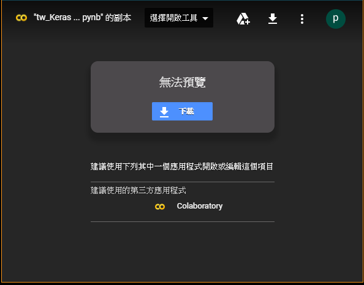</a>
	<a href="../../images/DL/colab/7.png">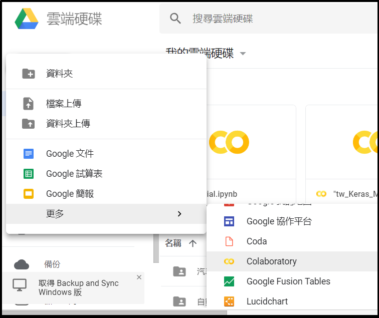</a>
	<figcaption></figcaption>
</figure>

目前中文介面似乎只有簡體中文版本而沒有繁體中文，習慣英文操作介面者可以如下圖中操作，或是直接在網址後面加上`?hl=en`便會自動改成英文介面。

<p align="center"><a href="../../images/DL/colab/4.png">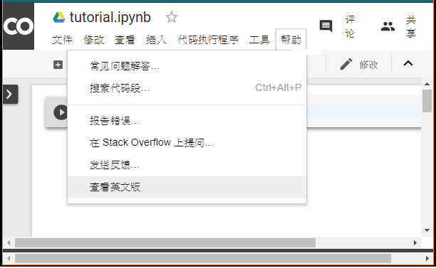</a></p>

其實檔案操作方法就很像Google Drive其他類型的檔案，擁有閱讀權限者可以看到上面做的所有程式碼編輯，但若直接運行未開放編輯權限的檔案會看到如左下圖中的警告標語。這時可以如右下圖操作把這份檔案複製一份到自己的Drive中，便可自由運行。

<figure class="half">
  <a href="../../images/DL/colab/2.png">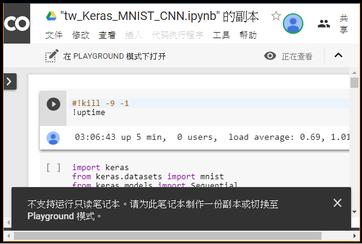</a>
	<a href="../../images/DL/colab/3.png">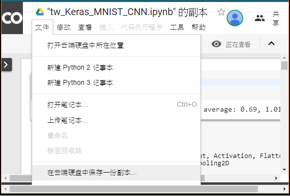</a>
	<figcaption></figcaption>
</figure>

## 2. 選取GPU作為運算單元

開啟檔案後預設的運行單元為CPU，若要改成GPU則可以按下面兩圖操作。

<figure class="half">
  <a href="../../images/DL/colab/5.png">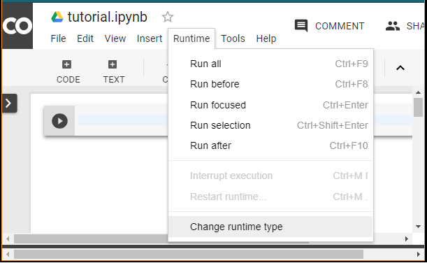</a>
	<a href="../../images/DL/colab/6.png">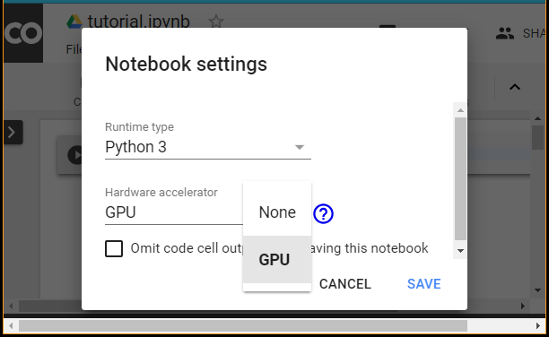</a>
	<figcaption></figcaption>
</figure>

更改後可以用運行這一段程式碼確認GPU運行正常

```python
import tensorflow as tf
device_name = tf.test.gpu_device_name()
if device_name != '/device:GPU:0':
  raise SystemError('GPU device not found')
print('Found GPU at: {}'.format(device_name))
```

若系統有抓到GPU，則會顯示：

<p align="center"><a href="../../images/DL/colab/8.png">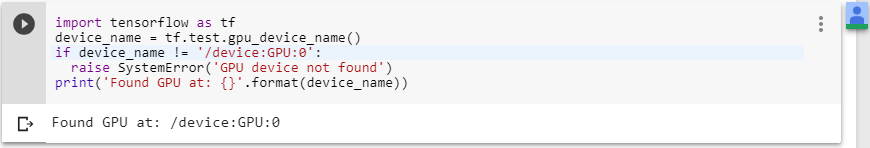</a></p>

## 3. 上傳/下載檔案

### 3.1 開啟權限

開始執行新的一份Notebook建議先運行下面這段程式碼，可以幫助安裝一些需要的package和開啟和Google Drive連動的權限。執行程式碼後會需要你開啟提示網站，複製上面的金鑰並貼回Notebook的Cell中再按enter。完成後會顯示成功開啟權限(如圖)。

```
!apt-get install -y -qq software-properties-common python-software-properties module-init-tools
!add-apt-repository -y ppa:alessandro-strada/ppa 2>&1 > /dev/null
!apt-get update -qq 2>&1 > /dev/null
!apt-get -y install -qq google-drive-ocamlfuse fuse
from google.colab import auth
auth.authenticate_user()
from oauth2client.client import GoogleCredentials
creds = GoogleCredentials.get_application_default()
import getpass
!google-drive-ocamlfuse -headless -id={creds.client_id} -secret={creds.client_secret} < /dev/null 2>&1 | grep URL
vcode = getpass.getpass()
!echo {vcode} | google-drive-ocamlfuse -headless -id={creds.client_id} -secret={creds.client_secret}
```

<p align="center"><a href="../../images/DL/colab/9.png">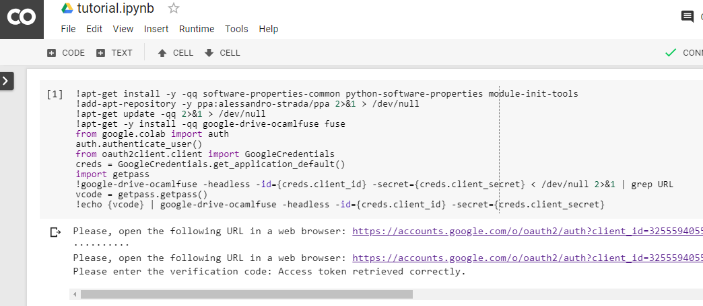</a></p>

### 3.2 上傳/下載至Google Drive

以下兩段程式碼功能分別為上傳和下載檔案。

第一段程式碼執行後會在該cell輸出中顯示按鈕，就可以從本機上選擇檔案，上傳後是傳到虛擬機中。

```python
from google.colab import files
uploaded = files.upload()
for fn in uploaded.keys():
  print('User uploaded file "{name}" with length {length} bytes'.format(
      name=fn, length=len(uploaded[fn])))
```
<p align="center"><a href="../../images/DL/colab/10.png">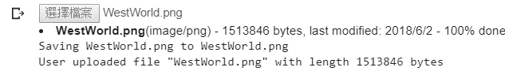</a></p>

而透過`files.download()`便可從虛擬機上下載檔案。

```python
files.download('WestWorld.png')
```


而以下程式碼則可以幫我們把虛擬機和自己的Google Drive連接，執行後虛擬機目錄下會多出一個名為Drive(可自行更改)的資料夾，內容即為自己的雲端資料。

```shell
!mkdir -p Drive
!google-drive-ocamlfuse Drive
```

而大部分Linux中用到的terminal指令(`mv`, `rm`, `wget`,`apt-get`...etc)，只需要在前面加上`!`就可以直接在cell中運行，如這裡展示用來下載網路檔案的wget指令，用後綴`-P`指定存放路徑，下圖為下載我GitHub上的一張圖到Drive中，Drive便會即時顯示這份檔案。

<p align="center"><a href="../../images/DL/colab/11.png">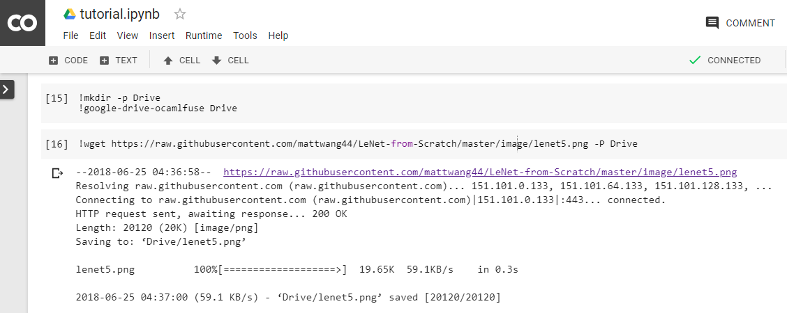</a></p>

<p align="center"><a href="../../images/DL/colab/12.png">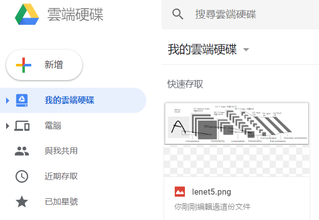</a></p>

### 3.3 從GitHub下載

若要開啟的是一份存放在GitHub上的Notebook，可以直接更改網址便能自動以Colab開啟。例如Notebook連結為:

`https://github.com/<一大串東西>.ipynb`

能用以下網址開啟：

`https://colab.research.google.com/github/<一大串東西>.ipynb`

而若是要複製整個repo，也可在Colab上使用`!git clone`指令，執行後也是存放到虛擬機上。不過要注意，若將東西從虛擬機移到自己雲端所要花費的時間頗長。

<p align="center"><a href="../../images/DL/colab/13.png">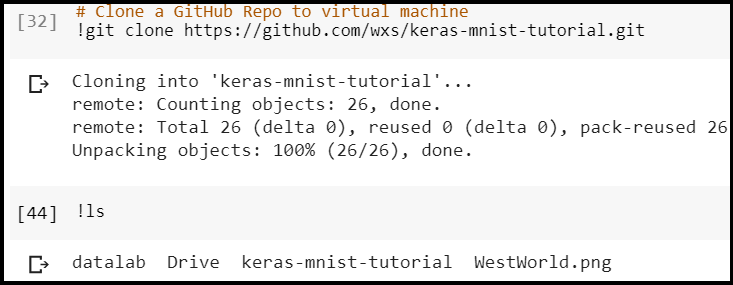</a></p>

### 3.4 查看目錄方法

`!ls`可以查看目前所在資料夾的目錄，若要查看特定資料夾之目錄可以用`!ls <資料夾路徑>`，或是先用Python code先移動到特定資料夾再下`!ls`指令：

```
import os
os.chdir("<資料夾路徑>")

!ls
```

## 4. 錯誤處理

若是出現`Warning: apt-key output should not be parsed (stdout is not a terminal)`警告標語，代表和自己雲端連接的權限已經到期，重新執行這段code就可以重新連接：

```
!mkdir -p drive
!google-drive-ocamlfuse drive
```

出現其他錯誤，可以執行下面這一行，斷開連結，重新連接虛擬機(主要使用時機為清除佔據記憶體的變數)：

```
!kill -9 -1
```

## 5. 安裝package

Keras

```
!pip install -q keras
import keras
```

PyTorch

```
from os import path
from wheel.pep425tags import get_abbr_impl, get_impl_ver, get_abi_tag
platform = '{}{}-{}'.format(get_abbr_impl(), get_impl_ver(), get_abi_tag())
accelerator = 'cu80' if path.exists('/opt/bin/nvidia-smi') else 'cpu'
!pip install -q http://download.pytorch.org/whl/{accelerator}/torch-0.3.0.post4-{platform}-linux_x86_64.whl torchvision
import torch
```

或`!pip3 install torch torchvision`

MxNet

```
!apt install libnvrtc8.0
!pip install mxnet-cu80
import mxnet as mx
```

OpenCV

```
!apt-get -qq install -y libsm6 libxext6 && pip install -q -U opencv-python
import cv2
```

XGBoost

```
!pip install -q xgboost==0.4a30
import xgboost
```

GraphViz

```
!apt-get -qq install -y graphviz && pip install -q pydot
import pydot
```

## 6. Reference

1. [Google Colab Free GPU Tutorial](https://medium.com/deep-learning-turkey/google-colab-free-gpu-tutorial-e113627b9f5d){:target="_blank"}
   * 本文主要資訊從這邊擷取
2. [Colab Official Tutoral](https://colab.research.google.com){:target="_blank"}
   * 官方教學，分量不多，建議可以全部掃過一遍
3. [Google Colab 免费GPU服务器使用教程](https://blog.csdn.net/cocoaqin/article/details/79184540){:target="_blank"}
   * 運行MNIST的範例
