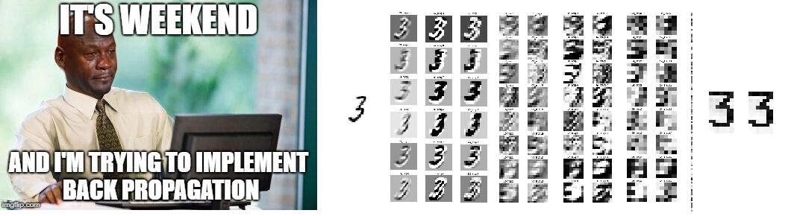

我目前是讀書會聯絡人之一，後來我為讀書會創了一個[GitHub page](https://pytorchtaipei.github.io){:target="_blank"}(原先整理在一頁的資料連結也移到了[這裡](https://pytorchtaipei.github.io/records/2018/spring/){:target="_blank"})，未來讀書會相關消息就統一發布在這個網站之下。

### 論文筆記

希望每周讀完論文、聽完講解後，能夠消化吸收再寫出一篇整理，目前穩定遲交中... 因為論文和比賽完全停擺中冏，有朝一日會認真完成的...


  


<!-- /.tiles -->

### 實作練習

不定期在[我的GitHub](https://github.com/mattwang44/){:target="_blank"}上更新

  

    
      

      

            <h4 class="panel-title">
              <a data-toggle="collapse" href="#collapse0"> ML/DL Fundamentals</a>
            </h4>
          

          

            

            <a target="_blank" href="https://github.com/mattwang44/ML-DL-practice/tree/master/MLP_backprop_MATLAB">
              <strong>MLP on Iris Dataset Using MATLAB </strong>
               用MATLAB手刻兩層隱藏層的MLP(多層感知器)，以Iris資料集中的三個特徵(原資料集有四個)訓練，準確率98%
            </a>
            

          

      

        <h4 class="panel-title">
          <a data-toggle="collapse" href="#collapse1">PyTorch Fundamentals</a>
        </h4>
      

      

        

          <a target="_blank" href="../../articles/01-Fundamentals-of-PyTorch-Tensor/">
            <strong>01. Fundamentals of PyTorch Tensor: </strong>
             PyTorch Tensor建立方法、Tensor和Numpy比較、如何在GPU上運行
          </a>
        

        

          <a target="_blank" href="../../articles/02-Variables-&-Gradients/">
            <strong>02. Variables & Gradients: </strong>
             建立Variable的方法、PyTorch中如何自動計算gradient
          </a>
        

      

<!-- 2 -->
      

        <h4 class="panel-title">
          <a data-toggle="collapse" href="#collapse2">LeNet-5</a>
        </h4>
      

      

        

          <a target="_blank" href="https://github.com/mattwang44/PyTorch_Taipei">
            PyTorch: Neural Networks & LeNet Implementation(整理中)
          </a>
        

        

          <a target="_blank" href="https://github.com/mattwang44/LeNet5_from_Scratch">
            <strong> LeNet-5 Implementation SCRATCH </strong>
                不用任何自動back-prop工具實現LeNet-5，20 epoches 訓練 (3.5小時 with CPU)，準確率98.6%。
                
          </a>
        

      

<!-- 3 --><!--
      

        <h4 class="panel-title">
          <a data-toggle="collapse" href="#collapse3">Week 3</a>
        </h4>
      

      

        

        

      
 -->
<!-- 4 --><!--
      

        <h4 class="panel-title">
          <a data-toggle="collapse" href="#collapse4">Week 4</a>
        </h4>
      

      

        

        

      
 -->
<!-- 5 --><!--
      

        <h4 class="panel-title">
          <a data-toggle="collapse" href="#collapse5">Week 5</a>
        </h4>
      

      

        

        

      
 -->
<!-- 6 --><!--
      

        <h4 class="panel-title">
          <a data-toggle="collapse" href="#collapse6">Week 6</a>
        </h4>
      

      

        

        

      
 -->
<!-- 7 --><!--
      

        <h4 class="panel-title">
          <a data-toggle="collapse" href="#collapse7">Week 7</a>
        </h4>
      

      

        

        

      
 -->
<!-- 8 --><!--
      

        <h4 class="panel-title">
          <a data-toggle="collapse" href="#collapse8">Week 8</a>
        </h4>
      

      

        

        

      
 -->
<!-- 9 --><!--
      

        <h4 class="panel-title">
          <a data-toggle="collapse" href="#collapse9">Week 9</a>
        </h4>
      

      

        

        

      
 -->
<!-- 10--><!--
      

        <h4 class="panel-title">
          <a data-toggle="collapse" href="#collapse10">Week 10</a>
        </h4>
      

      

        

        

      
 -->
<!-- 11--><!--
      

        <h4 class="panel-title">
          <a data-toggle="collapse" href="#collapse11">Week 11</a>
        </h4>
      

      

        

        

      
 -->
<!-- 12--><!--
      

        <h4 class="panel-title">
          <a data-toggle="collapse" href="#collapse12">Week 12</a>
        </h4>
      

      

        

        

      
 -->
<!-- 13--><!--
      

        <h4 class="panel-title">
          <a data-toggle="collapse" href="#collapse13">Week 13</a>
        </h4>
      

      

        

        

      
 -->
<!-- 14--><!--
      

        <h4 class="panel-title">
          <a data-toggle="collapse" href="#collapse14">Week 14</a>
        </h4>
      

      

        

        

      
 -->
<!-- 15--><!--
      

        <h4 class="panel-title">
          <a data-toggle="collapse" href="#collapse2">Week 15</a>
        </h4>
      

      

        

        

      
 -->
<!-- 16--><!--
      

        <h4 class="panel-title">
          <a data-toggle="collapse" href="#collapse16">Week 16</a>
        </h4>
      

      

        

        

      
 -->
<!-- 17--><!--
      

        <h4 class="panel-title">
          <a data-toggle="collapse" href="#collapse171">Week 17</a>
        </h4>
      

      

        

        

      
 -->
<!-- 18--><!--
      

        <h4 class="panel-title">
          <a data-toggle="collapse" href="#collapse18">Week 18</a>
        </h4>
      

      

        

        

      
 -->
<!-- 19--><!--
      

        <h4 class="panel-title">
          <a data-toggle="collapse" href="#collapse19">Week 19</a>
        </h4>
      

      

        

        

      
 -->
<!-- 20--><!--
      

        <h4 class="panel-title">
          <a data-toggle="collapse" href="#collapse20">Week 20</a>
        </h4>
      

      

        

        

      
 -->
<!-- 21--><!--
      

        <h4 class="panel-title">
          <a data-toggle="collapse" href="#collapse21">Week 21</a>
        </h4>
      

      

        

        

      
 -->
<!-- 22--><!--
      

        <h4 class="panel-title">
          <a data-toggle="collapse" href="#collapse22">Week 22</a>
        </h4>
      

      

        

        

      
 -->

    

  

